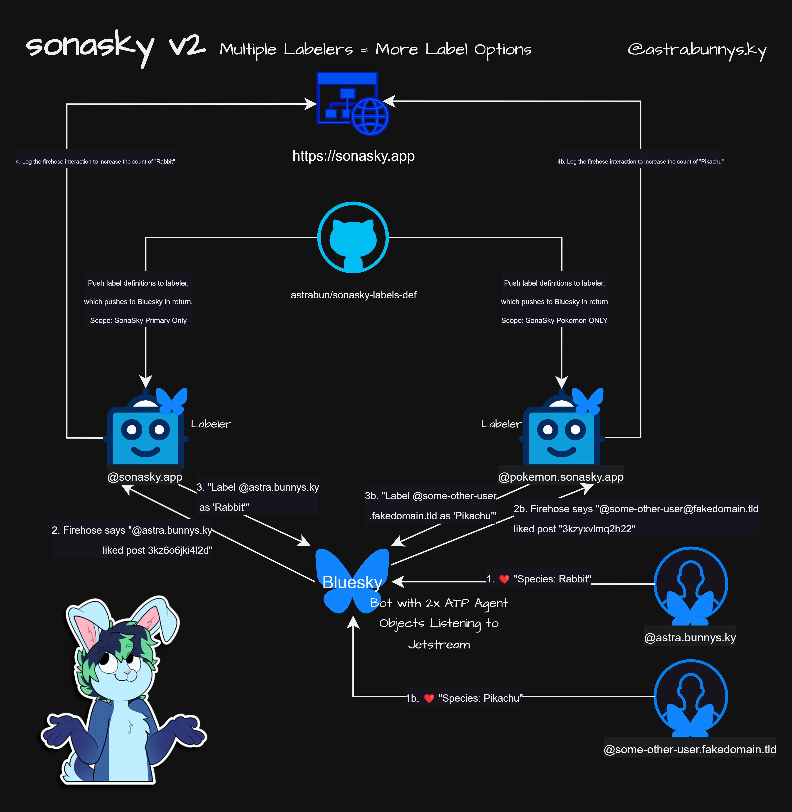

# @sonasky/labels-def

> Source-of-truth label definitions for SonaSky.

This package is for storing species labels within [SonaSky](https://bsky.app/profile/sonasky.bsky.social) [[Github]](https://github.com/astrabun/sonasky) | [[Browse Labels]](https://sonasky.app/) | [[Blog]](https://astrabun.com/projects/sonasky/). It replaces the now-archived repos: [sonasky-labels-def](https://github.com/astrabun/sonasky-labels-def) and [sonasky-labels-localization](https://github.com/astrabun/sonasky-labels-localization).

`src/labels.ts` holds every label's post, realm (which labeler it goes to), category, flags, and per-locale name/description, typed via `LabelDef` in `src/types.ts`. This package exposes:

- `labels` - the raw, typed `Record<string, LabelDef>`.
- `getAllLabels()` - every label across all realms (with `id` attached), for browsing/searching.
- `generateBskyDefs(realm?, englishOnly?)` / `generateBskyDefsEnglish(realm?)` - the filtered `labelValues` / `labelValueDefinitions` payload shape used to push definitions to a Bluesky labeler.
- `generateRealmsOptions()` - the set of realms present in the data.

## Updating labels

Edit `src/labels.ts` directly - it's plain typed TypeScript, so your editor will catch typos and missing fields.

---

## Multi-Labeler Architecture

To continue to offer additional label options, SonaSky has scaled into multiple labelers based on "realm". At the time of writing, there are two realms: 1) prime, and 2) pokemon. This moves all Pokemon labelers onto a separate Ozone/labeler instance (@pokemon.sonasky.app).



A single bot listens to the Bluesky Jetstream for in-scope like events and uses the appropriate labeler (based on the "realm" property) to apply the label to the account.

As a result, users should subscribe to both available labelers to see all labels applied by this system.

## Automation

This repo automatically syncs labels from the repo to the SonaSky labeler on new commits to the `main` branch.

## Localization

> looking for folks to help with translation! take a peek at `sonasky.yaml` to see if there's labels you can translate.

Languages: https://github.com/bluesky-social/social-app/blob/main/src/locale/languages.ts#L7C1-L25C2

Use the string value for the target locale you're contributing to. For example:

| Language                         | Lang value |
| -------------------------------- | ---------- |
| English                          | `en`       |
| Português (BR) – Portuguese (BR) | `pt-BR`    |

### Example:

Example Species:

```typescript
{
  "rabbit": {
    "post": "3kz6o6jki4l2d",
    "realm": "prime",
    "locales": [
      {
        "lang": "en",
        "name": "Rabbit",
        "description": "This user is a Rabbit! AKA: bunny, bnuy, bun"
      },
      {
        "lang": "pt-BR",
        "name": "Coelha/Coelho",
        "description": "Este usuário é um Coelho! AKA: Coelho, Coelinho."
      }
    ]
  },
}
```

Example Species that has a category:

```typescript
{
  "stoat": {
    "post": "3kzbz76vei22v",
    "realm": "prime",
    "category": {
      "en": "Mustelid",
      "pt-BR": "Mustelídeo"
    },
    "locales": [
      {
        "lang": "en",
        "name": "Stoat",
        "description": "This user is a Stoat!"
      },
      {
        "lang": "pt-BR",
        "name": "Arminho",
        "description": "Este usuário é um Arminho! AKA: Furão."
      }
    ]
  },
}
```

Categories make it easier to search/filter/sort on https://sonasky.app/

# Thank You

Special thanks to [JSimian](https://github.com/JSimian), [DrkLws](https://github.com/DrkLws), [InsertyEXE](https://github.com/InsertyEXE), and [DarkraiNemo](https://github.com/DarkraiNemo), who all contributed to pt-BR translations in the archived repo. See their commits [here](https://github.com/astrabun/sonasky-labels-localization/graphs/contributors), as they are not reflected in this new repo's commit history.
